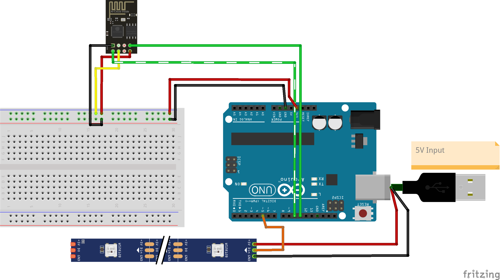

# Arduino LED-Stripe Controller

A lightweight collection of C++ programs/Arduino scripts to control LED stripes using an Arduino and serial communication with an ESP Wi-Fi microcontroller.
This project allows users to send custom color data from a locally hosted website to the Arduino to display effects in
real-time.

## Features

- Custom RGB values per LED-Stripe lamp
- Custom Wi-Fi settings
- Android App for controlling the LED-Stripe

## Project Structure

- Arduino scripts in `uno` project
- ESP Wi-Fi microcontroller scripts in `esp` project
- Android app in `app`
- Web-Portal in`esp/data`

## Prerequisites

- Arduino IDE for uploading the firmware
- ArduinoJson, ESPAsyncTCP and ESPAsyncWebServer for `esp` project
- FastLED for `uno` project
- A compatible Arduino board (tested on Arduino Uno)
- Addressable LED strip (e.g. WS2812B)

## Circuit

## Setup
- Upload the projects using the Arduino IDE
- Build the app using `./gradlew assembleDebug`
